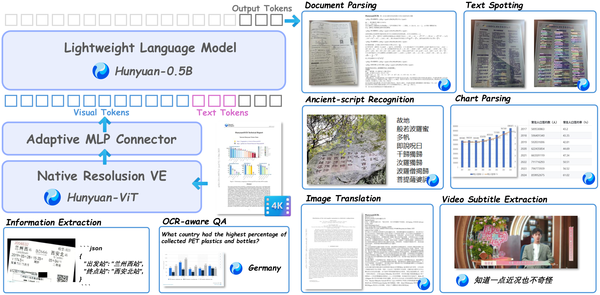

<div align="center">

[English Version](./README.md)

</div>

<div align="center">

# HunyuanOCR-1.5：迈向高效且强大的端到端 OCR

</div>

<p align="center">
  <br>
</p>

<p align="center">
<a href="https://huggingface.co/tencent/HunyuanOCR"><b>🤗 模型</b></a> |
<a href="https://arxiv.org/abs/2511.19575"><b>📄 技术报告 (v1.0)</b></a>
</p>

> [!NOTE]
> **HunyuanOCR-1.5 的技术报告与模型权重即将发布。**
> 当前 `develop` 分支提供 HunyuanOCR-1.5 的开源**训练与推理工具集**。
>
> 👉 需要原始的 **HunyuanOCR 1.0** 版本？请切换到
> [`main`](https://github.com/Tencent-Hunyuan/HunyuanOCR/tree/main) 分支，或阅读
> [`README_v1.0.md`](./README_v1.0.md) · [`README_zh_v1.0.md`](./README_zh_v1.0.md)。

---

## 📖 简介

**HunyuanOCR-1.5** 是一款轻量化的端到端 OCR 专用视觉语言模型（VLM）。它面向广泛的以文字为中心的视觉任务，将**文档解析、文字检测识别（Text Spotting）、信息抽取、图文翻译**统一到单个端到端 VLM 中。

在延续 HunyuanOCR-1.0 已验证的轻量化架构基础上，HunyuanOCR-1.5 **并未**重新设计模型主干，而是围绕**"更快、更强"**两个目标进行系统性升级：

- ⚡ **更快 —— DFlash 推理加速。**
  端到端 OCR 通常伴随较长的自回归解码，这在稠密文档、表格、公式等长结构化输出场景中会成为主要瓶颈。HunyuanOCR-1.5 适配了基于 **DFlash** 的投机解码（speculative decoding）框架：一个轻量的块扩散（block-diffusion）草稿模型并行起草多个候选 token，再由目标模型一次性验证。这显著降低了长结构化输出的解码延迟，同时**保持目标模型的输出分布不变**。

- 💻 **PC 端部署（llama.cpp）。**
  除了服务器级的 vLLM，HunyuanOCR-1.5 还支持通过 [`llama.cpp`](https://github.com/ggml-org/llama.cpp) 在 **CPU / 消费级 GPU / 笔记本** 上部署：使用转换后的 GGUF 权重和 OpenAI 兼容的 `llama-server`。同时我们还提供了一个适配 DFlash 的 `llama.cpp` 分支，因此同样的投机解码加速在 PC 端也可用。详见 [`docs/llama_cpp.md`](docs/llama_cpp.md)。

- 🧠 **更强 —— Agentic Data Flow + 升级的训练配方。**
  在数据侧，我们提出 **Agentic Data Flow**，一套由智能体驱动的数据构造系统，能把模型的短板转化为可执行的数据需求。智能体深度参与素材检索、基于工具的校验、样本清洗与数据流水线开发，并与算法工程师形成闭环迭代。在 HunyuanOCR-1.5 中，该系统被用于**低资源 OCR、古文字 OCR、多图文字类 QA** 等长尾能力的定向补强。
  在训练侧，我们对配方进行了系统性升级：预训练 Stage-3 被重新规划，纳入新产出的能力数据、多图数据与历史 OCR 数据，最大图像分辨率扩展到 **4K**、上下文窗口扩展到 **128K**；后训练阶段则优化 SFT 数据，并进一步在不同 OCR 任务上探索强化学习（RL），以放大 RL 带来的收益。

综合来看，HunyuanOCR-1.5 在**保留轻量化端到端模型部署优势**的同时，实现了**更快的推理与更广的 OCR 能力覆盖**。本仓库开源了 SFT / DFlash 训练流水线以及 transformers / vLLM 推理栈，方便社区复现、微调并拓展 OCR 专用 VLM。

---

## ⚙️ 环境

- Python 3.10+（已在 3.12 上测试）
- PyTorch 2.1+（CUDA 12.1+；已完整测试 cu130 构建）
- transformers 4.57+
- DeepSpeed 0.14+
- vLLM —— 根据运行内容二选一：
  - **AR 基线 / 单图服务**：`vllm==0.18.1`（正式发布版）已原生支持
    `HunYuanVLForConditionalGeneration`，无需 nightly、无需补丁。
  - **DFlash 投机解码**：需要 **vLLM nightly**（已测试 0.23.x cu130 构建），
    它注册了 `dflash` 投机解码方法。
  调优细节参见 [`docs/inference.md`](docs/inference.md)。

### 训练依赖

```bash
pip install -r requirements.txt
# flash-attn 需要手动编译安装：
pip install flash-attn --no-build-isolation
```

### 推理依赖（vLLM）

我们为推理使用一个**独立的 venv**，以便将 vLLM 与训练环境隔离。

**方案 1 —— AR 基线 / 单图服务（`vllm==0.18.1`，推荐）。**
正式发布版原生支持 `HunYuanVLForConditionalGeneration`，无需 nightly 或补丁：

```bash
pip install "vllm==0.18.1" "openai>=1.30.0" "pillow>=10.0.0"
```

验证模型是否已注册：

```bash
python -c "from vllm.model_executor.models.registry import ModelRegistry; \
print('HunYuanVL supported:', 'HunYuanVLForConditionalGeneration' in ModelRegistry.get_supported_archs())"
# 预期输出: HunYuanVL supported: True
```

**方案 2 —— DFlash 投机解码（vLLM nightly）。**
DFlash 投机解码服务需要 nightly 构建，它注册了 `dflash` 方法：

```bash
# vLLM nightly（cu130）；自带 DFlash 投机解码支持
uv pip install -U vllm \
    --torch-backend=cu130 \
    --extra-index-url https://wheels.vllm.ai/nightly

# runai-model-streamer 可加速从 HF/S3 加载大型 safetensors
uv pip install runai-model-streamer
```

> 💡 如果你使用的是 CUDA 12.x，请将 `--torch-backend=cu130` 替换为对应的
> 标签（如 `cu121`、`cu124`），其余保持不变。
---

## 🚀 训练

所有训练脚本都位于 `scripts/` 目录，并共享 `scripts/env_common.sh` 中的分布式环境变量。
多机训练通过标准的 `NNODES` / `NODE_RANK` / `MASTER_ADDR` / `MASTER_PORT` 环境变量支持。

### 1. 准备打包（packed）后的训练数据

我们先对每个原始 OCR JSONL 做分词，再把多个样本打包到长度上限
`packed_max_length=20480` 的单条序列中，以最大化 GPU 利用率。

**步骤 1** —— 在 `configs/data_list.txt` 中每行填入一个绝对路径，指向一个原始 OCR JSONL 文件。
JSONL 的数据格式说明见 [`docs/data_format.md`](docs/data_format.md)。

**步骤 2** —— 运行多进程的计数与打包流水线：

```bash
MODEL_PATH=/path/to/HunyuanOCR/base/model \
INPUT_LIST=./configs/data_list.txt \
PACK_LEN=20480 \
NUM_PROCESSES=32 \
THREADS_PER_PROCESS=8 \
bash scripts/pack_data.sh
```

输出：`./data/parsing_packed_20480.jsonl` —— 一个序列打包好、可直接用于训练的 JSONL。

该流水线的实现见 [`tools/pipeline_count_and_pack.py`](tools/pipeline_count_and_pack.py)
和 [`tools/pack_from_counted.py`](tools/pack_from_counted.py)。

### 2. 对 HunyuanOCR 基座模型进行 SFT

在打包后的 OCR 序列上进行完整的端到端 SFT（视觉编码器 + MLP + LLM）。
默认配置：`lr=2e-5`、`epochs=5`、每卡 batch=1、`packed_max_length=20480`。

```bash
MODEL_PATH=/path/to/HunyuanOCR/base/model \
TRAIN_DATA=./data/parsing_packed_20480.jsonl \
NPROC_PER_NODE=8 \
bash scripts/sft_base.sh
```

入口：[`train/train_hunyuan.py`](train/train_hunyuan.py)。
完整参数列表见 [`docs/training.md`](docs/training.md)。

### 3. 从零训练 DFlash 草稿模型

训练一个小型的块扩散草稿模型，为 HunyuanOCR 预测 K 个投机 token。
默认配置：`lr=1e-4`、`epochs=2`、`num_mask_tokens=16`、`sample_block_num=8`。

```bash
MODEL_PATH=/path/to/HunyuanOCR/base/model \
TRAIN_DATA=./data/parsing_packed_20480.jsonl \
NPROC_PER_NODE=8 \
bash scripts/sft_dflash.sh
```

入口：[`train/train_draft.py`](train/train_draft.py)。

### 4. 从已有 DFlash 检查点继续微调

当需要把已发布的 DFlash 草稿模型适配到更小 / 特定领域的数据集时使用。
推荐配置：`lr=2e-5`、`epochs=10`、`warmup_ratio=0.05`、`save_steps=500`。

```bash
MODEL_PATH=/path/to/HunyuanOCR/base/model \
DFLASH_INIT=/path/to/hyocr_dflash/existing_checkpoint \
TRAIN_DATA=./data/parsing_packed_20480.jsonl \
NPROC_PER_NODE=8 \
bash scripts/sft_dflash_finetune.sh
```

入口：[`train/train_draft_from_dflash.py`](train/train_draft_from_dflash.py)。

---

## 🧪 推理

提供三条路径，均可在**单张图片**上运行以做冒烟测试：

- **A. HuggingFace transformers** —— 单图，易于修改，推荐用于正确性调试。
- **B. vLLM（OpenAI 兼容）** —— 生产级服务；实现真正的 DFlash 加速所必需。
- **C. llama.cpp** —— CPU / 消费级 GPU / 笔记本部署（见下文）。

### A. HuggingFace transformers（单图调试）

脚本使用 transformers ≥ 4.57（HunyuanOCR-1.5 系列）中官方集成的
`HunYuanVLForConditionalGeneration` + `AutoProcessor`。

**基座模型 —— 单张图片：**

```bash
python inference/infer_base.py \
    --model /path/to/HunyuanOCR/base/model \
    --image /path/to/document.png \
    --max-new-tokens 8000
```

**基座模型 + DFlash 草稿 —— 在单图上做正确性 / 草稿加载校验：**

```bash
python inference/infer_dflash.py \
    --model /path/to/HunyuanOCR/base/model \
    --dflash-model ./hyocr_dflash/ \
    --image /path/to/document.png \
    --num-spec-tokens 15
```

默认的 OCR 提示词为：

```
提取文档图片中正文的所有信息用markdown格式表示，其中页眉、页脚部分忽略，
表格用html格式表达，文档中公式用latex格式表示，按照阅读顺序组织进行解析。
```

可用 `--prompt "..."` 覆盖。两个脚本都会打印加载耗时、生成延迟和解码后的文本。

> ℹ️ `infer_dflash.py` 仅验证 DFlash 草稿检查点能否加载，并在单图上产出与 AR 一致的
> 参考结果。真正的投机解码加速只有在 vLLM 下才能实现（见下文）。

### B. vLLM 生产级服务（OpenAI 兼容）

启动脚本与内部部署保持一致：服务别名
`tencent/HunyuanOCR`、`-tp 1`、`--limit-mm-per-prompt '{"image":4,"video":0}'`、
`--trust_remote_code`、`--max-model-len 131072`。

**下载权重。** 目标模型（1.5）位于
[`tencent/HunyuanOCR`](https://huggingface.co/tencent/HunyuanOCR) 仓库根目录；DFlash
草稿模型在其 [`dflash/`](https://huggingface.co/tencent/HunyuanOCR/tree/main/dflash)
子目录下，此前的 1.0 版本归档在 `v1.0/` 下。

```bash
pip install -U "huggingface_hub[cli]"

# 目标基座（1.5）—— 跳过归档的 1.0 以节省空间
hf download tencent/HunyuanOCR --local-dir ./HunyuanOCR --exclude "v1.0/*"

# DFlash 草稿 —— vLLM 的 --speculative-config 不接受 HF 子目录，
# 因此把 dflash/ 下载到一个扁平的本地目录，并让 DFLASH_PATH 指向它：
python -c "from huggingface_hub import snapshot_download; import shutil, os; \
d=snapshot_download('tencent/HunyuanOCR', allow_patterns=['dflash/*']); \
shutil.copytree(os.path.join(d,'dflash'), './hyocr_dflash', dirs_exist_ok=True)"
```

**自回归基线**（不带 DFlash 的 HunyuanOCR），单 GPU：

```bash
MODEL_PATH=./HunyuanOCR \
GPU=0 PORT=8000 GPU_MEM_UTIL=0.9 \
bash inference/serve_ar.sh
```

**DFlash 投机解码**（在有 DFlash 草稿时推荐；
需要 vLLM nightly，见 环境 → 方案 2）：

```bash
MODEL_PATH=./HunyuanOCR \
DFLASH_PATH=./hyocr_dflash \
GPU=0 PORT=8001 GPU_MEM_UTIL=0.9 \
NUM_SPEC_TOKENS=15 \
bash inference/serve_dflash.sh
```

两个端点都在 `http://<host>:<port>/v1/chat/completions` 暴露标准的 vLLM
OpenAI 兼容路由。可用以下命令等待服务就绪：

```bash
curl -sf http://127.0.0.1:8000/v1/models
# 或
tail -f vllm_ar_8000.log
```

**单图客户端** —— 用附带的脚本发送单张图片。它与内部 bench 流水线保持一致的
采样参数（`temperature=0.0`、`top_p=1.0`、`top_k=-1`、
`repetition_penalty=1.08`）以及流式的尾部重复早停策略。提示词的选择通过
`--task-type` 锁定为一组固定的官方任务类型（运行 `--list-tasks` 查看全部）：

```bash
python inference/infer_vllm_client.py \
    --host 127.0.0.1 --port 8000 \
    --model tencent/HunyuanOCR \
    --image /path/to/document.png \
    --task-type doc_parse \
    --max-tokens 32768
# 加 --no-stream 可关闭流式 + 早停
# 加 --no-doc-postprocess 可关闭 doc_parse 的 markdown 规范化
```

可用任务类型（`--task-type`）：`doc_parse`（默认）、`structured_parse`、
`spotting_json`、`spotting_hunyuan`、`layout`、`layout_parse`、`chart_parse`、
`formula`、`table`、`doc_trans_en2zh`、`trans_other2en`、`trans_other2zh`。

若要对整个目录做**批量**推理，请使用 `inference/batch_infer.py`（同样的
任务类型，支持多端点并发、可断点续跑）：

```bash
python inference/batch_infer.py \
    --image-dir /path/to/images \
    --out-dir   /path/to/output \
    --ports 8000 \
    --task-type doc_parse \
    --max-tokens 32768 \
    --concurrency 16
```

或用 OpenAI SDK 手写（与 `infer_vllm_client.py` 的行为一致，
但不含流式早停）：

```python
import base64
from openai import OpenAI

def data_url(p):
    # MIME 固定为 image/jpeg，与 vllm/infer_vllm_8gpu.py 一致
    return f"data:image/jpeg;base64,{base64.b64encode(open(p,'rb').read()).decode()}"

client = OpenAI(api_key="EMPTY", base_url="http://127.0.0.1:8000/v1")
resp = client.chat.completions.create(
    model="tencent/HunyuanOCR",
    messages=[
        {"role": "system", "content": ""},
        {"role": "user", "content": [
            {"type": "image_url", "image_url": {"url": data_url("/path/to/document.png")}},
            {"type": "text", "text": "请提取图片中的文字内容。"},
        ]},
    ],
    max_tokens=4096,
    temperature=0.0,
    top_p=1.0,
    extra_body={"top_k": -1, "repetition_penalty": 1.08, "skip_special_tokens": True},
)
print(resp.choices[0].message.content)
```

> ⚠️ 对于**多图**请求（每个 prompt 超过 1 张图），需要一个额外的 vLLM 形状修复
> 补丁 —— 这与单图 OCR 无关。若计划运行多图 bench，请参见
> [`docs/inference.md`](docs/inference.md)。

### C. PC 端部署（llama.cpp）

对于 **CPU / 消费级 GPU / 笔记本** 环境，HunyuanOCR-1.5 在将权重转换为 GGUF 后，也可以
通过 [`llama.cpp`](https://github.com/ggml-org/llama.cpp) 部署。
社区版 `llama.cpp`（仅支持 HunyuanOCR 基座）和一个适配 DFlash 的分支
（[`wendadawen/llama.cpp @ dflash-adapt-hunyuanocr-hunyuanstyle`](https://github.com/wendadawen/llama.cpp/tree/dflash-adapt-hunyuanocr-hunyuanstyle)）
都受支持。

最小化的构建与启动（社区版，不含 DFlash）：

```bash
# 1. 构建
git clone https://github.com/ggml-org/llama.cpp.git && cd llama.cpp
cmake -B build -DLLAMA_BUILD_EXAMPLES=ON     # NVIDIA GPU 追加 -DGGML_CUDA=ON
cmake --build ./build --config Release -j

# 2. 将 HunyuanOCR 转换为 GGUF（base + mmproj）
hf download tencent/HunyuanOCR --local-dir ./HunyuanOCR
python3 convert_hf_to_gguf.py --outfile ./HunyuanOCR/hyocr-f16.gguf        --outtype f16 ./HunyuanOCR
python3 convert_hf_to_gguf.py --outfile ./HunyuanOCR/mmproj-hyocr-f16.gguf --outtype f16 --mmproj ./HunyuanOCR

# 3. 启动服务（OpenAI 兼容）
build/bin/llama-server \
    --model  ./HunyuanOCR/hyocr-f16.gguf \
    --mmproj ./HunyuanOCR/mmproj-hyocr-f16.gguf \
    --host 0.0.0.0 --port 8080 --alias HYVL \
    --ctx-size 10240 --n-predict 4096
```

适配 DFlash 的变体、草稿模型的权重转换，以及一个冒烟测试客户端
（[`llama_cpp/chat.py`](llama_cpp/chat.py)，附带 [`llama_cpp/test_assets/`](llama_cpp/test_assets)
下的 26 张示例 OCR 图片）：

完整指南参见 [`docs/llama_cpp.md`](docs/llama_cpp.md)。

---

## 📖 文档

- [`docs/training.md`](docs/training.md) —— 训练模式、超参数、分布式配置
- [`docs/data_format.md`](docs/data_format.md) —— 原始 OCR JSONL 格式与打包流水线
- [`docs/inference.md`](docs/inference.md) —— vLLM 安装（nightly，含 DFlash）与部署调优
- [`docs/llama_cpp.md`](docs/llama_cpp.md) —— 使用 llama.cpp 的 PC 端部署（社区版 & DFlash 适配分支）
- [`docs/benchmark.md`](docs/benchmark.md) —— 端到端速度基准测试

---

## 📜 许可证

HunyuanOCR-1.5 采用与 HunyuanOCR 1.0 相同的许可证 ——
**Tencent Hunyuan Community License Agreement（腾讯混元社区许可协议）**。
完整条款见 [`LICENSE`](LICENSE)。
